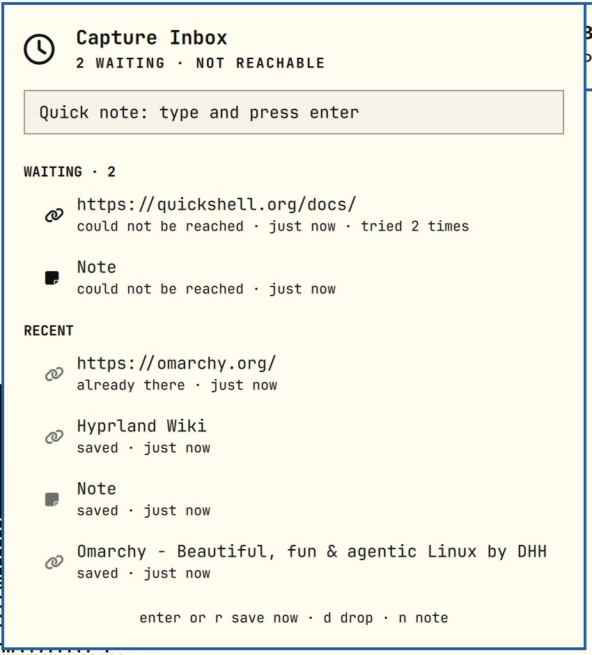

# Capture Inbox

Save links, notes and screenshots as Markdown files with one key, from anywhere on [Omarchy](https://omarchy.org).
A bar widget shows what you captured, what is still waiting, and takes a quick note.



## What you get

- **A folder of Markdown files.** `~/Documents/Captures/Inbox/` by default, one file per capture with YAML front
  matter. Point an Obsidian or Logseq vault at the folder, sync it with Syncthing, or just read the files.
- **Links** get their page title fetched and become `2026-09-22-1540-page-title.md` with the address and your note.
  Saving the same link twice is noticed, not duplicated.
- **Notes** from a quick-note box in the panel, or a floating editor. The first line is the title.
- **Screenshots** through Omarchy's region picker, saved under `Inbox/attachments/` and embedded in a note.
- **The clipboard**, whatever is on it: a URL, an image or text goes to the right place.
- **Never lost.** If the folder is not there (an unmounted disk, a Syncthing share that has not come up), the
  capture waits in a private queue and is saved when the folder is back. The widget checks once a minute.
- **A journal** of recent captures: for links the title and address; for notes and screenshots only that one
  happened. Note text never leaves the file it was saved to.

## Install

```bash
omarchy plugin add https://github.com/cgranier/omarchy-capture-inbox.git --enable
```

Then give yourself keys. Plugins cannot add keybindings, so add these to `~/.config/hypr/bindings.lua`
(the paths are where `omarchy plugin add` put the plugin):

```lua
local capture = os.getenv("HOME") .. "/.config/omarchy/plugins/cgranier.capture/bin/capture"
o.bind("SUPER + SHIFT + M", "Capture clipboard", capture .. " clip")
o.bind("SUPER + SHIFT + N", "Capture a note", capture .. " note")
o.bind("SUPER + CTRL + M", "Capture a screenshot", capture .. " shot")
```

Optional menu rows, in `~/.config/omarchy/extensions/omarchy-menu.jsonc`:

```jsonc
"trigger.capture-clip": {"icon":"󰅍","label":"Capture clipboard","action":"~/.config/omarchy/plugins/cgranier.capture/bin/capture clip"},
"trigger.capture-note": {"icon":"󰏫","label":"Capture a note","action":"~/.config/omarchy/plugins/cgranier.capture/bin/capture note"},
"trigger.capture-shot": {"icon":"󰹑","label":"Capture a screenshot","action":"~/.config/omarchy/plugins/cgranier.capture/bin/capture shot"}
```

To use a different folder: `~/.config/omarchy/plugins/cgranier.capture/bin/capture setup ~/Notes/vault`.
A folder you chose is never created for you: if it is missing, captures wait for it.

Needs `jq`, `curl`, `grim`, `wl-paste` and `gum`, all part of a stock Omarchy.

## Uninstall

```bash
omarchy plugin remove cgranier.capture
rm -rf ~/.local/state/capture-inbox    # optional: queue and journal
rm -rf ~/.config/capture-inbox         # optional: the folder choice
```

Your captured files stay where they are.

## The panel

| Key | Does |
|---|---|
| `j` / `k`, arrows | move |
| `enter` | on something waiting: save the queue now. On a link in the history: open it |
| `r` | save the queue now |
| `R` | also retry what was refused |
| `d` | drop the selected waiting capture without saving it |
| `n` | jump to the quick-note box (`esc` leaves it) |
| middle click on the bar icon | save the queue now |

The bar shows a dimmed inbox glyph when there is nothing to do, and a clock with a count while captures wait.

## The CLI

```
capture url <url> [note]      capture note [text]       capture shot [--full] [--url <page>] [note]
capture clip [note]           capture queue [--json]    capture retry [--quiet] [--refused]
capture journal [--json]      capture reachable         capture setup [folder]
```

A saved capture prints `{"status":"ok","title":…,"file":…}`; one that had to wait prints
`{"status":"queued","id":…}` and exits 0.

## Bring your own backend

The widget only ever runs a CLI with those subcommands and reads what it prints. Point `command` at another
program that speaks them (a webhook client, say) and the panel works unchanged:

```
omarchy bar set cgranier.capture command /path/to/your-cli
omarchy bar set cgranier.capture journal /path/to/its/journal.jsonl   # if it keeps one elsewhere
```

Other settings: `autoRetry` (default on) and `historyCount` (default 12).

## Development

```
bin/capture        the CLI: folder backend, queue, journal
Panel.qml          bar button + popup (entry point)
Service.qml        runs the CLI, watches the journal
Model.js           pure logic: rows, labels, counts
tests/             node tests for the model, bash tests for the CLI (against a temp folder)
```

```bash
node tests/model.test.js
bash tests/capture.test.sh
omarchy plugin validate .
```

## License

MIT
